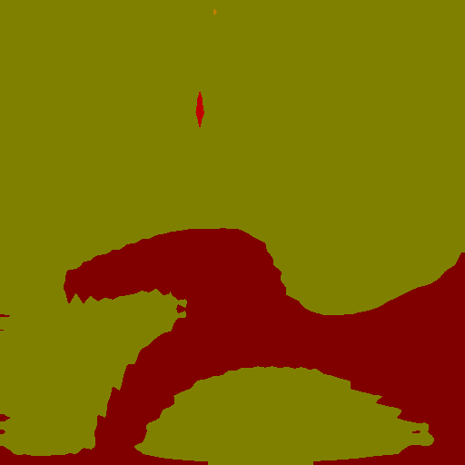

# CCNet_paddle


## 1 简介
  
本项目基于paddlepaddle框架复现了CCNet语义分割模型.

**论文：**
- [1] Huang Z, Wang X, Huang L, et al. [CCNet: Criss-Cross Attention for Semantic Segmentation](https://arxiv.org/abs/1811.11721)

**项目参考：**
- [https://github.com/speedinghzl/CCNet/tree/pure-python](https://github.com/speedinghzl/CCNet/tree/pure-python)

## 2 复现精度
>在CityScapes val数据集的测试效果如下表。


| NetWork | steps |opt| image_size | batch_size |dataset|memory|card|  mIou  |                                                     config                                                     |                          weight                           |             log             |
|:-------:|:-----:| :---: |:----------:|:----------:| :---: | :---: | :---: |:------:|:--------------------------------------------------------------------------------------------------------------:|:---------------------------------------------------------:|:---------------------------:|
|  CCNet  |  60K  |SGD|  769x769   |     8      |CityScapes|32G|4| 80.95% | [ccnet_resnet101_os8_cityscapes_769x769_60k.yml](configs/ccnet/ccnet_resnet101_os8_cityscapes_769x769_60k.yml) | [link 提取码：z1da](https://pan.baidu.com/s/108xV62Mmn8wztX2gxKsHLQ ) | [log](train_log/trainer-log.txt) |

## 3 数据集
[CityScapes dataset](https://www.cityscapes-dataset.com/)

- 数据集大小:
    - 训练集: 2975
    - 验证集: 500

## 4 环境依赖
- 硬件: Tesla V100 * 4

- 框架:
    - PaddlePaddle == 2.2.2


## 快速开始

### 第一步：克隆本项目
```bash
# clone this repo
git clone https://github.com/justld/CCNet_paddle.git
cd CCNet_paddle
```

**安装第三方库**
```bash
pip install -r requirements.txt
```


### 第二步：训练模型

单卡训练：
```bash
python train.py --config configs/ccnet/ccnet_resnet101_os8_cityscapes_769x769_60k.yml  --do_eval --use_vdl --log_iter 100 --save_interval 4000 --save_dir output
```
多卡训练：
```bash
python -m paddle.distributed.launch train.py --config configs/ccnet/ccnet_resnet101_os8_cityscapes_769x769_60k.yml  --do_eval --use_vdl --log_iter 100 --save_interval 1000 --save_dir output
```

### 第三步：测试
output目录下包含已经训练好的模型参数以及对应的日志文件。(权重文件在上方的表格中)
```bash
python val.py --config configs/ccnet/ccnet_resnet101_os8_cityscapes_769x769_60k.yml --model_path {your_model_path}
```

### 第四步：tipc
进入DDRNet_paddle文件夹，首先准备轻量级训练数据集，命令如下（会下载完整的cityscapes数据集）：
```bash
bash test_tipc/prepare.sh ./test_tipc/configs/ccnet/train_infer_python.txt 'lite_train_lite_infer'
```
接着运行训练推理一体化测试脚本：
```bash
bash test_tipc/test_train_inference_python.sh ./test_tipc/configs/ccnet/train_infer_python.txt 'lite_train_lite_infer'
```
脚本会自动进行轻量级训练测试和推理，其推理结果如下图（只训练了50 iters，效果比较差）。  
原图（来自cityscapes验证集）：
  
预测结果（tipc只训练50iters预测结果，resize到512x512）：



## 5 代码结构与说明
**代码结构**
```
├─benchmark  
├─configs  
├─deploy  
├─images  
├─configs  
├─slim  
├─images  
├─output  
├─paddleseg  
├─test_tipc  
│  export.py  
│  predict.py  
│  README.md  
│  README_CN.md  
│  requirements.txt  
│  setup.py  
│  train.py  
│  val.py  
```
**说明**
1、本项目在Aistudio平台，使用Tesla V100 * 4 脚本任务训练120K miou达到80.95%。  
2、本项目基于PaddleSeg开发。  

## 6 模型信息

相关信息:

| 信息 | 描述                                                                                                                                              |
| --- |-------------------------------------------------------------------------------------------------------------------------------------------------|
| 作者 | 郎督                                                                                                                                              |
| 日期 | 2022年4月                                                                                                                                         |
| 框架版本 | PaddlePaddle==2.2.2                                                                                                                             |
| 应用场景 | 语义分割                                                                                                                                            |
| 硬件支持 | GPU、CPU                                                                                                                                         |
| 在线体验 | [notebook] |


## 7 Citation
```
@misc{liu2021paddleseg,
      title={PaddleSeg: A High-Efficient Development Toolkit for Image Segmentation},
      author={Yi Liu and Lutao Chu and Guowei Chen and Zewu Wu and Zeyu Chen and Baohua Lai and Yuying Hao},
      year={2021},
      eprint={2101.06175},
      archivePrefix={arXiv},
      primaryClass={cs.CV}
}

@misc{paddleseg2019,
    title={PaddleSeg, End-to-end image segmentation kit based on PaddlePaddle},
    author={PaddlePaddle Contributors},
    howpublished = {\url{https://github.com/PaddlePaddle/PaddleSeg}},
    year={2019}
}

@article{huang2020ccnet,
  author={Huang, Zilong and Wang, Xinggang and Wei, Yunchao and Huang, Lichao and Shi, Humphrey and Liu, Wenyu and Huang, Thomas S.},
  journal={IEEE Transactions on Pattern Analysis and Machine Intelligence}, 
  title={CCNet: Criss-Cross Attention for Semantic Segmentation}, 
  year={2020},
  month={},
  volume={},
  number={},
  pages={1-1},
  keywords={Semantic Segmentation;Graph Attention;Criss-Cross Network;Context Modeling},
  doi={10.1109/TPAMI.2020.3007032},
  ISSN={1939-3539}}

@article{huang2018ccnet,
    title={CCNet: Criss-Cross Attention for Semantic Segmentation},
    author={Huang, Zilong and Wang, Xinggang and Huang, Lichao and Huang, Chang and Wei, Yunchao and Liu, Wenyu},
    booktitle={ICCV},
    year={2019}}
```

